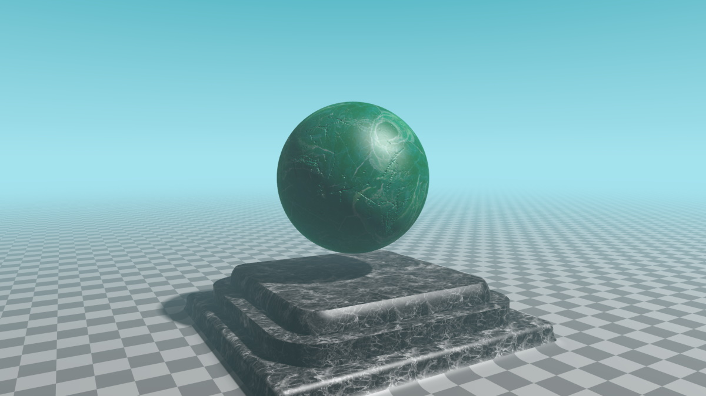

# [RayMarching](https://ustymukhman.github.io/ray-marching/dist) #

*GLSL RayMarching Experiment*

## Download ##

`git clone https://github.com/UstymUkhman/ray-marching.git`

`cd ray-marching`

## Develop ##

`yarn`

`yarn start`

## Lint ##

`yarn lint`

## Build ##

`yarn build`

`yarn serve`
